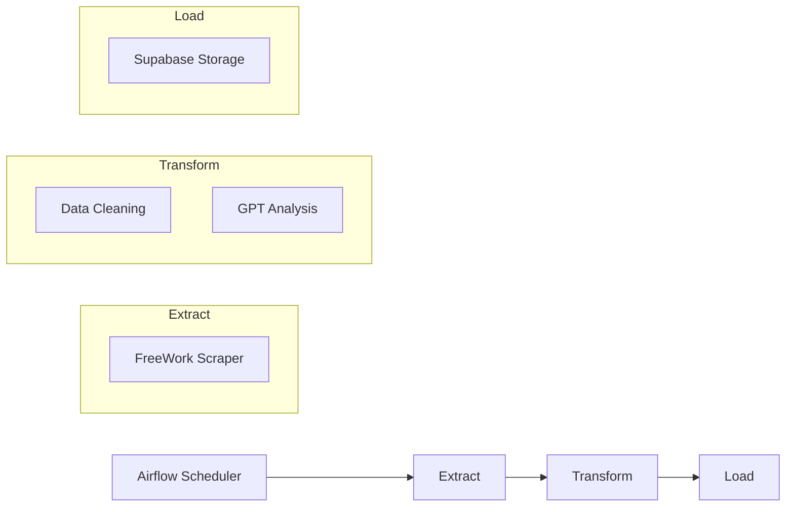

# 🔒 Notes de Développement (Privé)

## 🎯 Objectifs du Projet
- Scraper FreeWork de manière éthique
- Analyser et catégoriser les offres avec GPT
- Fournir des insights sur le marché
- Dashboard pour visualiser les tendances

## 🏗 Architecture Détaillée

```
JobAnalyzer/
├── airflow/                      # Orchestration ETL
│   └── dags/                    # DAGs Airflow
│       ├── job_analyzer.py      # DAG principal
│       └── utils/              # Utilitaires pour DAGs
│
├── backend/
│   ├── models/                  # Modèles et logique métier ✅
│   │   ├── entities/           # Modèles principaux
│   │   │   └── job_offer.py    # Modèle d'une offre ✅
│   │   └── value_objects/      # Objets de valeur
│   │       └── enums.py        # Énumérations ✅
│   │
│   ├── application/            # Cas d'utilisation
│   │   ├── extract.py          # Logique d'extraction ⏳
│   │   ├── transform.py        # Logique de transformation ⏳
│   │   └── load.py            # Logique de chargement ⏳
│   │
│   └── infrastructure/         # Détails techniques
│       ├── config/
│       │   └── settings.py     # Configuration ✅
│       ├── database/
│       │   └── supabase.py     # Client Supabase ⏳
│       └── services/
│           ├── scraper.py      # Service de scraping ⏳
│           └── ai_analyzer.py  # Service GPT ⏳
│
├── tests/                      # Tests
│   ├── unit/                  # Tests unitaires ⏳
│   └── integration/          # Tests d'intégration ⏳
│
└── docker/                    # Configuration Docker
    ├── Dockerfile             # ✅
    └── docker-compose.yml     # ✅
```

## 🔄 État Actuel du Projet

### ✅ Terminé
1. **Structure du Projet**
   - Architecture backend définie
   - Configuration Docker
   - Structure Airflow

2. **Modèles de Données**
   - JobOffer (Pydantic)
   - Enums (Domaines, Types, etc.)
   - Configuration de base

3. **Base de Données**
   - Schéma Supabase créé
   - Types ENUM définis
   - Tables principales créées

### ⏳ En Cours
1. **Infrastructure**
   - Client Supabase à implémenter
   - Service de scraping à développer
   - Service GPT à configurer

2. **Application**
   - Logique d'extraction à écrire
   - Transformation des données
   - Chargement dans Supabase

### 📝 Prochaines Étapes
1. Implémenter le client Supabase
2. Développer le service de scraping
3. Configurer le service GPT
4. Écrire les tests unitaires de base

## 🔄 Flux de Données



## 📝 TODO List

### Phase 1: Infrastructure (En cours)
- [x] Structure du projet
- [x] Configuration de base
- [ ] Client Supabase
- [ ] Service de Scraping
- [ ] Service GPT

### Phase 2: Application
- [x] Modèles de données
- [x] Value Objects
- [ ] Logique d'extraction
- [ ] Logique de transformation
- [ ] Logique de chargement

### Phase 3: Tests & Qualité
- [ ] Tests unitaires
- [ ] Tests d'intégration
- [ ] Documentation
- [ ] CI/CD

## 🔐 Informations Sensibles

### URLs FreeWork
- Base: https://www.free-work.com/fr/tech-it
- API: https://api.free.work/v1/
- Login: /auth/login
- Search: /search/missions

### Headers nécessaires
```python
headers = {
    "User-Agent": "Mozilla/5.0...",
    "Accept": "application/json",
    "Origin": "https://www.free-work.com"
}
```

## 📊 Structure Base de Données

### Table JOB_OFFERS (Supabase)
```sql
CREATE TYPE job_domain AS ENUM ('DATA', 'FULLSTACK', 'WEB3', 'AI', 'MOBILE');
CREATE TYPE job_status AS ENUM ('NEW', 'ANALYZED', 'ARCHIVED');
CREATE TYPE remote_type AS ENUM ('100%', 'PARTIEL');
CREATE TYPE company_type AS ENUM (
    'Agence de COM / RH',
    'Agence WEB / Communication',
    ...
);
```

## 🔄 Workflow de Développement

1. Branches
   - `main`: production
   - `develop`: développement
   - `feature/*`: nouvelles fonctionnalités
   - `fix/*`: corrections

2. Tests
   - Unit tests (pytest)
   - Integration tests
   - E2E tests

3. CI/CD
   - GitHub Actions
   - Docker Build
   - Cloud Run Deploy

## 📈 Métriques à Suivre
- Nombre d'offres scrapées/jour
- Taux de succès du scraping
- Précision de la classification IA
- Temps de traitement par offre
- Coût API OpenAI/jour

## 🐛 Problèmes Connus
- Rate limiting FreeWork
- Authentification nécessaire
- Gestion des sessions
- Détection anti-bot possible

## 💡 Idées Futures
- Export des données en CSV
- API publique
- Notifications Discord/Slack
- Comparaison multi-plateformes
- ML pour prédiction des TJM 